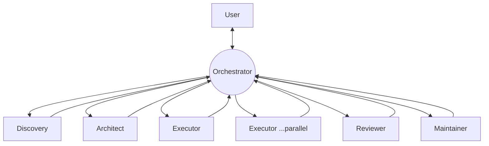

# `.kandev/` — reusable KanDev operating system

This directory is the **process foundation** for Songara PWAs, the counterpart to the
**code foundation** shipped as [`@songara/pwa-base`](../docs/guides/consuming-pwa-base.md).
It holds role prompts, ticket templates, lightweight decision records, and workflow
guides that every future PWA repository can inherit.

It is intentionally **thin**. It does not restate engineering behaviour, report shapes,
or architecture rules — it links to their sources of truth:

| Source of truth | Owns |
| --- | --- |
| [`CURSOR.md`](../CURSOR.md) | Execution philosophy, validation ladder, Developer Actions, Task lifecycle, Definition of Done |
| [`apps/telemetry/src/types.ts`](../apps/telemetry/src/types.ts) + [`completion-report-contract.ts`](../apps/telemetry/src/completion-report-contract.ts) | `RunCompletionSummary` shape + section registry (never redefine sections elsewhere) |
| [`docs/architecture.md`](../docs/architecture.md) + [`docs/adr/`](../docs/adr/) | Package map, dependency rules, accepted decisions |
| [ADR-003](../docs/adr/003-phase2-shared-packages.md) | **Two-consumer rule** — the gate for promoting code into PWA-Base |
| [`docs/guides/consuming-pwa-base.md`](../docs/guides/consuming-pwa-base.md) | Public API surface + `file:../PWA-Base` consumption |
| [`CONTRIBUTING.md`](../CONTRIBUTING.md) | Branch workflow, ownership boundaries, **no auto-merge** |
| [`docs/reviews/review-checklist.md`](../docs/reviews/review-checklist.md) | Human/reviewer walkthrough |

## Purpose

Give every PWA project the same operating instructions from day one, so process is a
copyable asset rather than tribal knowledge. Each role knows what it produces, each
ticket has a consistent shape, and each workflow says **which role runs when**.

## Relationship to PWA-Base

PWA-Base is the canonical **upstream** for both dimensions:

- **Code** flows *up* into `@songara/pwa-base` under the ADR-003 two-consumer rule (see
  [`workflows/promote-to-pwa-base.md`](./workflows/promote-to-pwa-base.md)).
- **Process** flows *down*: sibling repos copy this `.kandev/` and treat PWA-Base's copy
  as the version to sync against.

## Contents

```text
.kandev/
├── README.md                     # this file
├── prompts/                      # reusable role operating instructions
│   ├── _shared.md                #  cross-cutting rules every role inherits
│   ├── orchestrator.md           #  persistent coordinator; owns project flow & user contact
│   ├── discovery.md              #  scope a request → discovery ticket / research report
│   ├── architect.md              #  shape the technical approach, decide shared vs app-local
│   ├── executor.md               #  implement code / docs / migrations / refactors
│   ├── reviewer.md               #  read-only review against the checklist + DoD
│   └── maintainer.md             #  cross-repo stewardship, promotion, versioning
├── templates/                    # consistent ticket shapes across projects
│   ├── discovery-ticket.md
│   ├── research-report.md        #  informational Discovery output (no implementation)
│   ├── architecture-decision.md  #  drafting shape for a formal ADR (docs/adr/)
│   ├── feature-ticket.md
│   ├── bug-ticket.md
│   └── promotion-ticket.md
├── decisions/                    # lightweight decision records (NOT formal ADRs)
│   ├── README.md
│   └── 0000-template.md
└── workflows/                    # human-readable "which role, when" guides
    ├── new-feature.md
    ├── bug-fix.md
    ├── refactor.md
    └── promote-to-pwa-base.md
```

## Orchestration model

Work is coordinated by a **persistent [Orchestrator](./prompts/orchestrator.md)**. The user
talks to the Orchestrator; the Orchestrator owns project state and dispatches specialists.
Specialist roles are **disposable workers** — created for a piece of work, they do it, report
back, and go away. The Orchestrator is the hub of every hand-off:



Key properties:

- **The Orchestrator owns project flow.** It decides the next task from **project state**,
  not by walking a fixed sequence.
- **Specialists are disposable workers.** They never talk to the user; they report to the
  Orchestrator using the 9-item completion report in [`_shared.md`](./prompts/_shared.md).
- **Multiple Executors may run simultaneously** when the work is genuinely independent
  (non-overlapping packages/files; sequence anything sharing `pnpm-lock.yaml`).
- **Every specialist reports back to the Orchestrator**, which reviews the work against the
  original objective and presents the user-facing summary.

### The roles

| Role | Prompt | Typically produces | Notes |
| --- | --- | --- | --- |
| **Orchestrator** | [`prompts/orchestrator.md`](./prompts/orchestrator.md) | task sequencing, delegation, user-facing summaries | Persistent; rarely implements (trivial docs only) |
| **Discovery** | [`prompts/discovery.md`](./prompts/discovery.md) | [discovery ticket](./templates/discovery-ticket.md) or [research report](./templates/research-report.md) | Clarifies problem & scope; writes no code |
| **Architect** | [`prompts/architect.md`](./prompts/architect.md) | [architecture decision](./templates/architecture-decision.md) draft (→ `docs/adr/`) or a [decision record](./decisions/) | Applies the two-consumer rule and dependency rules |
| **Executor** | [`prompts/executor.md`](./prompts/executor.md) | code, docs, migrations, refactors + completion summary | Build Mode per `CURSOR.md`; not just features; may run in parallel |
| **Reviewer** | [`prompts/reviewer.md`](./prompts/reviewer.md) | review findings | **Read-only**; never fix-forward |
| **Maintainer** | [`prompts/maintainer.md`](./prompts/maintainer.md) | promotions, version bumps, `.kandev/` upkeep | Cross-repo steward; owns the promotion gate |

### Typical flow

```text
User → Orchestrator → Discovery → Orchestrator → Architect → Orchestrator
     → Executor(s) → Orchestrator → Reviewer → Orchestrator
     → Maintainer (if required) → Orchestrator → User
```

The Orchestrator returns to the centre after every step and chooses what happens next.
**Architect is skippable** for small features and most bug fixes; **Maintainer** runs only
when promotion or a release is involved. The [workflow guides](./workflows/) describe typical
sequences the Orchestrator adapts to project state.

## Formal ADRs vs lightweight decisions

- **Formal ADR** — architecture boundaries, dependency rules, public API changes.
  Lives in [`docs/adr/`](../docs/adr/). Draft with
  [`templates/architecture-decision.md`](./templates/architecture-decision.md).
- **Lightweight decision record (LDR)** — a quick, local, reversible call that does not
  warrant a formal ADR. Lives in [`decisions/`](./decisions/). See its
  [README](./decisions/README.md).

Rule of thumb: *if it changes a boundary in `docs/architecture.md`, it is an ADR; if it is
a tactical choice within an accepted boundary, it is an LDR.*

## How future projects consume these assets

1. Copy `.kandev/` into the new repo when scaffolding.
2. Adjust only project-specific deltas (project name, extra workflows). Keep the prompts,
   templates, and workflow guides pointing at their sources of truth.
3. Treat PWA-Base's `.kandev/` as upstream: periodically diff and pull improvements.
4. In an isolated KanDev worktree, run the sibling linker before install (per the
   `songara-sibling-file-deps` rule):

   ```bash
   node "${SONGARA_PROJECTS_ROOT:-$HOME/projects}/PWA-Base/scripts/ensure-sibling-file-deps.mjs"
   ```

## Maintaining this directory

Owned by the **Maintainer** role. When you change an asset here, keep it thin: if you find
yourself copying rules from `CURSOR.md`, the report contract, or an ADR, link instead.
