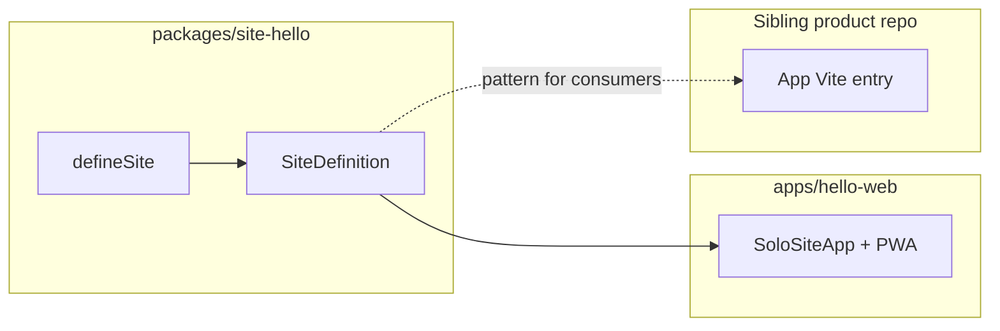

# Architecture

PWA-Base is a **pnpm monorepo foundation**: shared `@platform/*` packages published to
sibling apps as `@songara/pwa-base`, plus one reference PWA (`hello-web` / `site-hello`).
Product applications are **not** hosted in this repository.

**Identity:** [ADR-007](./adr/007-pwa-base-reusable-foundation.md). **Living strategy:**
[VISION.md](./milestones/VISION.md). Agent behaviour: root [`CURSOR.md`](../CURSOR.md).

| Layer | Where | Role |
| --- | --- | --- |
| Dev / validation | Ubuntu VM | Day-to-day work on this checkout and sibling apps |
| Production | Proxmox | Website Hosting (and any legacy Telemetry retained there) |
| Telemetry | Not in this repo | KanDev + `packages/completion-report` for engineering reporting |

## Decisions (ADRs)

| ADR | Summary |
| --- | --- |
| [001 — Modular monolith host](./adr/001-modular-monolith-host.md) | Historical host packaging; **superseded in part** by ADR-007 |
| [002 — Site registration catalog](./adr/002-site-registration-catalog.md) | `defineSite` contract remains; in-repo catalog host gone; **superseded in part** by ADR-007 |
| [003 — Shared packages](./adr/003-phase2-shared-packages.md) | Two-consumer rule for extracting shared kits |
| [004 — Packageable applications](./adr/004-packageable-applications.md) | App identity ≠ deploy topology; `@platform/runtime` |
| [005 — Content Packs](./adr/005-content-packs.md) | Versioned/hash-verified packs |
| [006 — KanDev sibling deps](./adr/006-kandev-sibling-file-deps.md) | `file:../` + linker for worktrees |
| [007 — Reusable foundation](./adr/007-pwa-base-reusable-foundation.md) | **Current identity** — sibling product repos; hello reference only |
| [008 — Preview / Stable lifecycle](./adr/008-preview-stable-capability-lifecycle.md) | Curated Preview integrations → Stable graduation |

Full index: [docs/adr/README.md](./adr/README.md).

Capability lifecycle: [capability-lifecycle.md](./guides/capability-lifecycle.md) ·
Preview layout: [preview-packages.md](./guides/preview-packages.md).

## Package map

```
@songara/pwa-base (pnpm workspace root)
├── apps/hello-web              Reference solo PWA entry
├── packages/site-hello         Reference site feature module
├── packages/site-registry      defineSite / SiteDefinition contract
├── packages/runtime            PWA helpers, Content Packs, SoloSiteApp
├── packages/ui                 Design tokens + primitives
├── packages/controls           Parameter panels
├── packages/export             Browser download helpers
├── packages/math + physics     Numeric helpers
├── packages/markdown           Markdown helpers
├── packages/animation          Particle / animation kit (Stable)
├── packages/audio              Web Audio kit (Stable)
├── packages/browser            Capability probes
├── packages/render             Canvas / RAF helpers
├── packages/preview-*          Curated OSS Preview integrations (ADR-008)
├── packages/completion-report  RunCompletionSummary contract
└── packages/config             Shared TS / ESLint / Prettier baselines
```

Existing kits without a `/preview/` export are **implicit Stable**. Do not re-home them
under `packages/stable/`. Preview packages use `packages/preview-<name>/` and export only
via `@songara/pwa-base/preview/<name>`.

Guides: [solo-packaging.md](./guides/solo-packaging.md), [content-packs.md](./guides/content-packs.md),
[consuming-pwa-base.md](./guides/consuming-pwa-base.md),
[preview-packages.md](./guides/preview-packages.md).

### Dependency rules

| Consumer | May depend on | Must not depend on |
| --- | --- | --- |
| `apps/hello-web` | `site-hello`, `@platform/runtime`, `@platform/ui`, shared kits | Other product site packages (none in-tree) |
| `packages/site-hello` | `@platform/site-registry/contract`, `@platform/runtime`, shared kits, React | App entry internals |
| Shared Stable kits (`ui`, `runtime`, …) | Browser APIs; peers as declared; other Stable kits only when justified | Site packages; sibling app repos; Preview packages |
| Preview kits (`preview-*`) | Declared OSS peers; Stable kits when justified | Site packages; product repos |
| Sibling product apps / Test-PWA | Documented `@songara/pwa-base` entry points only (incl. `/preview/*`) | Deep imports into `@platform/*` workspace paths; Test-PWA as a library |

Inside the monorepo use `@platform/*`. In sibling apps import only from `@songara/pwa-base`
documented exports.

## Reference app flow



1. **Site package** exports `defineSite({ id, basePath: "/", title, routes })` from
   `@platform/site-registry/contract`.
2. **Packaging** — thin `apps/hello-web` mounts via `SoloSiteApp` with its own Vite PWA.
3. **Sibling apps** copy that pattern in their own repo and depend on `@songara/pwa-base`.

Step-by-step packaging notes: [creating-a-new-site.md](./guides/creating-a-new-site.md)
and [solo-packaging.md](./guides/solo-packaging.md).

## Design system

Shared visual language lives in `@platform/ui` and is documented under
[docs/design-system/](./design-system/). [theme strategy](./design-system/theme-strategy.md)
describes how apps should consume tokens and components.

## Deployment

- **Dev (Ubuntu VM)** — `pnpm dev` for the hello reference app; `pnpm lint` / `typecheck` /
  `test` for validation.
- **Production (Proxmox)** — human-operated Website Hosting stack; not required for
  foundation Definition of Done on this VM.

## Testing boundaries

Unit tests cover foundation packages (`pnpm test:unit`). Playwright covers the reference
app smoke (`pnpm test:e2e`). Details: [testing.md](./guides/testing.md).

## Reporting

Completion report shape: `packages/completion-report` /
`@songara/pwa-base/completion-report`. Guide: [run-report-standard.md](./guides/run-report-standard.md).
Do not point agents at `apps/telemetry` or `PUT /telemetry/...`.
