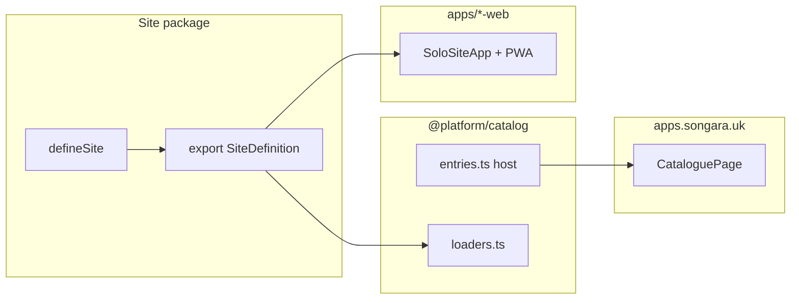

# Architecture

Website Hosting is a **modular monorepo**: independently packaged applications share packages and a catalogue host. Architecture decisions are recorded as ADRs; this document summarizes how the pieces fit together.

**Platform strategy** (vision, capability inventory, roadmap, application ideas) lives under [`docs/milestones/`](./milestones/)—start with [PLATFORM.md](./milestones/PLATFORM.md). Browse strategy Markdown via **docs.songara.uk** ([Document Explorer guide](./guides/document-explorer.md)).

## Decisions (ADRs)

| ADR                                                                       | Summary                                                                          |
| ------------------------------------------------------------------------- | -------------------------------------------------------------------------------- |
| [001 — Modular monolith host](./adr/001-modular-monolith-host.md)         | Historical default packaging; evolved by ADR-004                                 |
| [002 — Site registration catalog](./adr/002-site-registration-catalog.md) | Path-based registration via `defineSite` + catalog metadata                      |
| [003 — Shared packages](./adr/003-phase2-shared-packages.md)              | Two-consumer rule for extracting shared kits                                     |
| [004 — Packageable applications](./adr/004-packageable-applications.md)   | App identity ≠ deploy topology; independent hosts; `@platform/runtime`           |
| [005 — Content Packs](./adr/005-content-packs.md)                         | Versioned/hash-verified packs; complete first install; deferrable updates        |

Full index: [docs/adr/README.md](./adr/README.md).

## Package map

```
website-hosting (pnpm workspace root)
├── apps/platform              Catalogue SPA (apps.songara.uk)
├── apps/*-web                 Independent app packaging entries (*.songara.uk)
├── apps/telemetry             Cursor hook ingest / Task lifecycle (:4310)
├── apps/docs-api              Read-only Markdown docs API (:4320)
├── packages/site-registry     Registration / AppManifest contract
├── packages/catalog           Catalogue metadata + optional site loaders
├── packages/runtime           PWA helpers, connectivity, Content Packs, SoloSiteApp
├── packages/ui + kits         Design system / domain libs
└── packages/site-*            Application feature modules
```

Guides: [solo-packaging.md](./guides/solo-packaging.md), [content-packs.md](./guides/content-packs.md), [memory-experiences.md](./guides/memory-experiences.md).

### Dependency rules

| Consumer                  | May depend on                                                                                      | Must not depend on                                          |
| ------------------------- | -------------------------------------------------------------------------------------------------- | ----------------------------------------------------------- |
| `@platform/host` (catalogue) | `@platform/catalog` (metadata), `@platform/runtime`, `@platform/ui`                             | Individual `@platform/site-*` packages                      |
| Solo `*-web` entries      | One site package + `@platform/runtime` + UI                                                        | Other site packages; catalogue shell                        |
| Site packages             | `@platform/site-registry/contract`, `@platform/runtime`, shared kits, React                        | Host / `*-web` internals; `@platform/catalog`               |
| `@platform/runtime`       | Browser APIs; `workbox-window`; site-registry types; React/router peers                            | Site packages                                               |
| `@platform/catalog`       | Site packages only via `./loaders` (tests/tooling)                                                 | Host internals                                              |

Catalogue links use `https://${host}/` from `packages/catalog/src/entries.ts`. Applications mount at `/` on their own origin.

## Registration flow

Applications do not self-register at runtime. A maintainer adds catalogue metadata and packaging explicitly.



1. **Site package** imports `defineSite` from `@platform/site-registry/contract` and exports `defineSite({ id, basePath: "/", title, routes })`.
2. **Catalogue metadata** — add `host` in `packages/catalog/src/entries.ts` (linked from `apps.songara.uk`).
3. **Packaging** — thin `apps/<id>-web` mounts the site via `SoloSiteApp` with its own Vite PWA; Compose + Traefik `Host(...)` publishes the subdomain.

Adding an application does **not** require catalogue-host source changes. Step-by-step: [creating-a-new-site.md](./guides/creating-a-new-site.md), [solo-packaging.md](./guides/solo-packaging.md).

## Host behavior (current)

- `apps.songara.uk` (`@platform/host`) — catalogue only; links are `https://${host}/`.
- Each `*.songara.uk` app — independent SPA/PWA at `/` with its own service worker.
- **Catalogue PWA** — Songara Studio catalogue install (`start_url: "/"`).
- **App PWAs** — each `*-web` entry has its own manifest / SW. Dashboard keeps NetworkFirst for `/telemetry/**`. See [PWA installation](./guides/pwa-installation.md).

## Telemetry & AI Development Dashboard

- Package: `@platform/telemetry` (Docker service on `:4310`, version **0.2.6**).
- Dashboard: `dashboard.songara.uk` (`@platform/dashboard-web` → `@platform/site-dashboard`) — **History** is task-centric (Tasks group Runs); Conversation / Files / Shell / All Events remain on run drill-in.
- **Engineering contract:** root [`CURSOR.md`](../CURSOR.md) — behaviour for Cursor/agents. Guide: [engineering-contract.md](./guides/engineering-contract.md).
- **Completion report SoT:** `RunCompletionSummary` in `apps/telemetry/src/types.ts` + section validation in `completion-report-contract.ts`. See [run-report-standard.md](./guides/run-report-standard.md).
- **Task model:** one open Task per `conversation_id`; multiple Cursor `prompt_submitted` events consolidate as Runs under that Task. Completion report + Actions Required live on the Task. See [run-lifecycle.md](./guides/run-lifecycle.md).
- Run completion still stores per-run summaries; Task auto-complete promotes/uses Task-level `completionSummary`.
- Delete: `DELETE /api/runs/:id`. After API changes always `pnpm telemetry:rebuild` (not only `telemetry:up`).
- Notifications: in-app inbox + OS Notification stubs (client localStorage, default off). Architecture: [notification-architecture.md](./guides/notification-architecture.md).
- Actions Required / Dev Diagnostics derive restart vs HMR guidance from modified paths (inside the Task report).

## Design system

Shared visual language lives in `@platform/ui` and is documented under [docs/design-system/](./design-system/). The Components catalogue (`components.songara.uk`) is kept current via `pnpm --filter @platform/site-components generate:catalog`. [theme strategy](./design-system/theme-strategy.md) describes how apps should consume tokens and components.

## Deployment

- **Dev** — `pnpm --filter @platform/host dev` (catalogue :5173); per-app `pnpm --filter @platform/*-web dev` (see [solo-packaging.md](./guides/solo-packaging.md)).
- **Docker** — Compose builds catalogue + each `*-web` image; Traefik routes by Host. Dashboard nginx proxies `/telemetry/`; docs nginx proxies `/docs-api/`.

## Testing boundaries

Unit tests cover catalog loaders and host utilities; Playwright covers the catalogue landing page and dashboard report flows. Details: [testing.md](./guides/testing.md).

## Adding or extracting applications

Applications are already independently packaged. Add new apps via catalogue `host` + `apps/*-web` + Compose (see [creating-a-new-site.md](./guides/creating-a-new-site.md)). Historical path-mount notes remain in [ADR-002](./adr/002-site-registration-catalog.md#extractability-notes).
