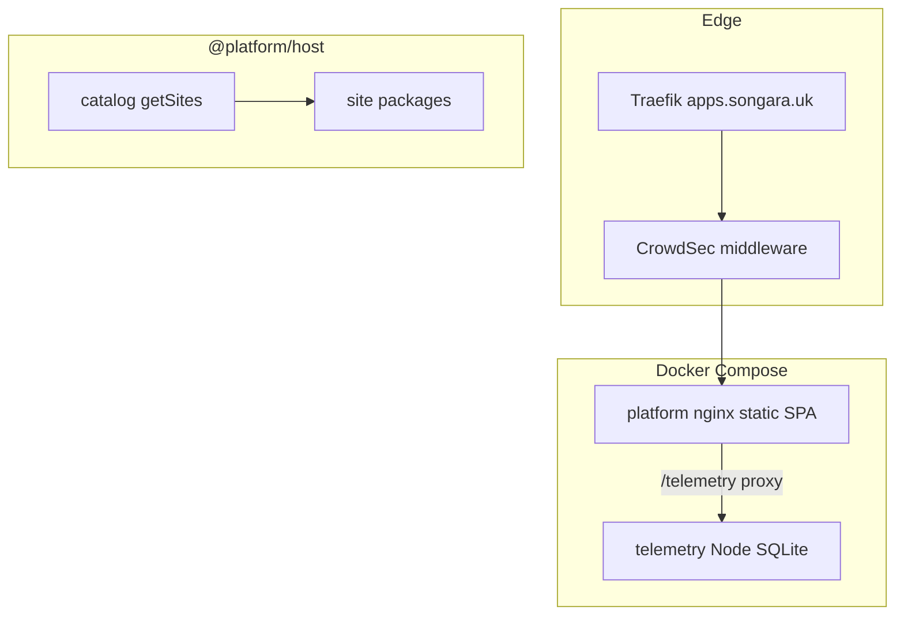

# Platform Assessment

> **Historical — not current intent.** Archived under `docs/archive/strategy/`. Living
> north star: [VISION.md](../../milestones/VISION.md) and
> [ADR-007](../../adr/007-pwa-base-reusable-foundation.md). This file describes the former
> Website Hosting monorepo.

| | |
| --- | --- |
| **Status** | Historical (superseded by VISION v1 / ADR-007) |
| **Version** | 0.1.0 |
| **Last reviewed** | 2026-07-21 |
| **Related** | [ROADMAP.md](./ROADMAP.md) · [IDEAS.md](./IDEAS.md) · [VISION.md](../../milestones/VISION.md) |

---

## Purpose

Current-state architecture, domains, capabilities, debt, and missing foundations—grounded in the repository as it existed then. Complements runtime docs in [`docs/architecture.md`](../../architecture.md).

## How to update

When packages, sites, or services change: update inventory tables, capability **Status**, and debt notes. Bump version and **Last reviewed**. Do not invent capabilities that are not in the tree.

---

## 1. Architecture summary

Website Hosting is a **modular monolith**: one Vite + React + TypeScript SPA (`@platform/host`) mounts path-prefixed sites from an explicit catalog. A separate Docker service (`@platform/telemetry`) provides Cursor-hook ingest, Task/Run lifecycle, SQLite persistence, WebSocket live updates, artifacts, and notifications. Production edge routing uses Traefik (`apps.songara.uk`) with CrowdSec middleware; the platform container’s nginx reverse-proxies `/telemetry/` to the telemetry service on the Docker network.

Decisions: [ADR-001](../adr/001-modular-monolith-host.md), [ADR-002](../adr/002-site-registration-catalog.md), [ADR-003](../adr/003-phase2-shared-packages.md). Agent behaviour: root [`CURSOR.md`](../../CURSOR.md).

### What exists today

| Layer | Reality |
| --- | --- |
| Shape | Modular monorepo; catalogue never imports `@platform/site-*` |
| Catalogue | `@platform/host` — apps.songara.uk application catalogue |
| Apps | Independent `*-web` hosts: components, docs, stats, viz, birthday, browser-lab, dashboard |
| Shared libs | `ui`, `controls`, `export`, `math`, `physics`, `config`, `site-registry`, `catalog`, `runtime` |
| Platform service | `@platform/telemetry` **0.2.6** — hooks, Tasks/Runs, SQLite, WS, artifacts, inbox |
| Infra | Compose on external `workspace_network`; Traefik Host rules per app; telemetry volume + `:4310` |
| DX | CURSOR.md, ADRs, design-system docs, Vitest + Playwright, two-consumer rule |

### Already complete (do not re-propose)

- Modular packages + catalogue registration
- Design tokens + core UI primitives + theme
- ParameterPanel, browser export helpers, shared math
- Telemetry Task lifecycle, completion-report contract, engineering contract
- Per-app PWA packaging (ADR-004)
- Traefik host routing for catalogue + each application

---

## 2. Applications (sites)

| Site id | Host | Package | Packaging |
| --- | --- | --- | --- |
| `components` | `components.songara.uk` | `@platform/site-components` | `@platform/components-web` |
| `docs` | `docs.songara.uk` | `@platform/site-docs` | `@platform/docs-web` |
| `stats` | `stats.songara.uk` | `@platform/site-stats` | `@platform/stats-web` |
| `viz` | `viz.songara.uk` | `@platform/site-viz` | `@platform/viz-web` |
| `birthday` | `birthday.songara.uk` | `@platform/site-birthday` | `@platform/birthday-web` |
| `browser-lab` | `browser-lab.songara.uk` | `@platform/site-browser-lab` | `@platform/browser-lab-web` |
| `dashboard` | `dashboard.songara.uk` | `@platform/site-dashboard` | `@platform/dashboard-web` |

Catalogue metadata: `packages/catalog/src/entries.ts` (removed post-M0).

---

## 3. Shared packages

| Package | Role | Notes |
| --- | --- | --- |
| `@platform/config` | Shared TS / ESLint / Prettier | Toolchain baseline |
| `@platform/site-registry` | `defineSite` / contract types | Sites import `/contract` |
| `@platform/catalog` | `getSites()`; only package that imports sites | Host dependency |
| `@platform/ui` | Tokens + primitives + ThemeProvider | Forms, layout, feedback; deferred: modal, toast, table, tabs, icons |
| `@platform/controls` | `ParameterPanel` + `ParamDef` | Used by components, stats, viz |
| `@platform/export` | `downloadText` / `Blob` / `CanvasPng` | stats + viz |
| `@platform/math` | clamp/lerp/linspace + sample stats | physics, stats, viz |
| `@platform/physics` | Fixed-timestep simulation engine | Primarily viz (cymatics / audio stems) |

Uneven reuse: birthday largely consumes tokens only; dashboard uses UI heavily but not controls/export/math; physics API is broad relative to current consumers.

---

## 4. Platform services & infrastructure

| Component | Role |
| --- | --- |
| `platform` Compose service | Multi-stage build → nginx serves `apps/platform/dist`; Traefik Host `apps.songara.uk` |
| `telemetry` Compose service | Node API + WS; SQLite + artifacts volume; `traefik.enable=false`; host reachability via nginx proxy and published `4310` |
| `docker/nginx.conf` | SPA fallback; `/telemetry/` proxy with WebSocket upgrade; `/health` |
| CrowdSec | Referenced as Traefik middleware at the edge |
| CI | No in-repo GitHub Actions workflows |
| Proxmox | Hosting assumed; no Proxmox-specific docs in this repository |

Local docs that still mention **8080** publish or “Traefik comments-only” are **stale** relative to current `docker-compose.yml` (see debt).

---

## 5. Domains

Only domains that exist or are clearly required for the vision:

| Domain | Status | Notes |
| --- | --- | --- |
| Infrastructure | Exists | Compose, Traefik, nginx, volumes, external network |
| Application Host | Exists | Host, catalog, PWA, landing |
| UI Framework | Partial | Strong primitives/theme; gaps in overlays, tables, shared charts, media UI |
| Interactive Controls | Exists | ParameterPanel + export downloads |
| Computation & Visualisation | Partial | math/physics shared; canvas/WebGL/audio frameworks largely site-local in viz |
| Observability / AI Dev | Strong | Telemetry + dashboard (Cursor-centric, not general APM) |
| Developer Experience | Strong | CURSOR.md, ADRs, guides, typecheck/test scripts |
| Data & Persistence | Partial | Telemetry SQLite only; no general app data API |
| Storage & Media | Partial | Content Pack format + runtime client (static `/packs`); no object-store sidecar yet |
| Identity & Security | Edge-only | CrowdSec; **no** application auth/session |
| Content | Missing | No notes/CMS data model |

---

## 6. Capability matrix

Status: **Not Started** / **Partial** / **Complete**.

| Name | Status | Purpose | Applications that would reuse it | Depends on | Enables | Engineering value | Priority |
| --- | --- | --- | --- | --- | --- | --- | --- |
| Site registration & host shell | Complete | Mount many apps under one deploy | All current + future sites | registry, catalog | Multi-app ecosystem | Very high (done) | Maintain |
| Design tokens + UI primitives | Partial | Shared look/feel and accessible controls | All browser apps | — | Coherent UX; faster UI work | High | Near-term polish |
| Parameter / export / math kits | Complete | Interactive demos + numeric helpers + downloads | stats, viz, components; future labs | ui | New interactive apps without reinventing forms | High (done) | Maintain |
| Physics / simulation kit | Partial | Reusable simulation primitives | viz today; future sims | math | Advanced labs | Medium | Opportunistic |
| Canvas / lab chrome | Partial | Shared render/lab UX | viz-local today; calculator later | ui, controls | VizKit consumers | Medium | After 2nd consumer |
| Charting / plotting kit | Not Started | Shared charts (intentionally deferred ADR-003) | stats (local), stocks, calculator, dashboards | ui, math | Stock analysis, calculator, widgets | High when 2nd consumer | Long-term |
| Components catalogue | Complete | Living inventory of UI | Contributors, agents | ui, controls | Design-system discipline | Medium (done) | Maintain |
| Telemetry ingest + Task/Run lifecycle | Complete | Cursor workflow observability | dashboard | Docker, SQLite | AI-assisted delivery | High (done) | Maintain |
| Completion report contract | Partial | Single schema + validation; dashboard still mirrors types | telemetry, dashboard, agents | telemetry types | Safer report evolution | Medium–high | Immediate |
| Notifications (inbox / ntfy) | Partial | In-app + provider stubs; no Web Push | dashboard | telemetry | Ops awareness | Medium | Later |
| PWA install shell | Partial | Multi-app host SW + `@platform/runtime` update/defer; Birthday Ready-gated packs; solo `birthday-web` packaging proof | dashboard + birthday | host, runtime | Offline-complete apps | High | Near-term |
| Platform service pattern | Partial | Telemetry is the only sidecar reference | Notes, stocks, media backends | Compose, nginx proxy | Repeatable backends | Very high | Near-term |
| Identity / session | Not Started | Authn for self-hosted users | Notes, private dashboards, media libraries | Service pattern | Private apps | Very high | Near-term |
| App data plane | Not Started | Generic CRUD, migrations, app namespaces | Notes, watchlists, user dashboards | Identity, service pattern | Most data apps | Very high | Near-term |
| Object / blob storage | Not Started | Durable files/images/assets beyond static packs | Media, builder, converter | Service pattern | Media + builder | Very high | Long-term |
| Content Packs (client) | Partial | Versioned/hash-verified packs; Ready gate; static nginx/Vite public | Birthday (first consumer); future media apps | runtime | Offline-complete installs | Very high | Maintain / extend |
| Media pipeline | Not Started | Upload, thumbs, conversion | Image/GIF manager, file converter | Object storage | Media apps | High | Long-term |
| Content / notes model | Not Started | Structured personal content | Notes, productivity | Identity, data plane | Content suite | High | Long-term |
| Shared app chrome (account/nav) | Partial | Host shell exists; weak cross-app account UX | All apps | Identity | Cohesive product feel | Medium–high | Long-term |
| CI / automated gates | Not Started | Lint/typecheck/test on every change | Whole platform | — | Regression safety | High | Immediate–near |
| Backup / restore runbooks | Not Started | Protect telemetry (and future) volumes | Ops | Infra | Longevity | Medium–high | Long-term |
| Auth at app layer | Not Started | Same as Identity | See Identity | — | — | — | — |

---

## 7. Duplication & technical debt

| Signal | Detail |
| --- | --- |
| Doc drift | `architecture.md` package map incomplete vs catalog; README / local-dev still describe Traefik as comments-only and host on `:8080` |
| Testing guide lag | `docs/guides/testing.md` still describes empty-catalog foundation scope; unit/e2e coverage is broader |
| Type / export duplication | `RunCompletionSummary` mirrored in dashboard; markdown export helpers duplicated |
| Site-local charts | stats `AnalysisChart`, browser-lab sparklines—no shared chart package (by design until 2nd consumer) |
| Overlays / tables | Modal, toast, tooltip, table deferred in design system; sites invent local equivalents |
| Birthday deps | Declares `controls` / ui beyond tokens with little runtime use |
| Physics surface area | Broad API; production use concentrated in viz |
| No CI | Reviews accepted deferred GitHub Actions |
| Foundation reviews | `docs/archive/reviews/*` are historical; do not treat as live inventory |

---

## 8. Missing foundations (for the stated vision)

Highest leverage gaps relative to Notes, stocks, media, builder, and private dashboards:

1. **Identity** — without it, every private app invents access control.
2. **App data plane** — telemetry SQLite is not a general application database.
3. **Object storage + media** — required for files, images, GIFs, builder assets.
4. **Documented platform service pattern** — so the next sidecar is not a one-off.
5. **Honest docs sync** — planning fails when README/architecture disagree with Compose.
6. **Shared report contracts package** — small but high-ROI against drift.
7. **CI** — velocity without automated gates accumulates silent breakage.

Charting and deep canvas frameworks remain **deliberately deferred** until a second consumer justifies extraction (ADR-003).

---

## 9. What the platform already does well

- Clear modular-monolith boundaries and site registration discipline.
- Usable shared UI + interactive/export/math kits for labs and analysis.
- Mature Cursor-oriented telemetry and dashboard for delivery workflows.
- Docker-first deploy with real Traefik edge integration.
- Strong agent/human engineering contract (`CURSOR.md`) and ADR culture.
- Extractability path for sites documented (ADR-002).

---

## 10. Quick answers

| Question | Answer |
| --- | --- |
| What does the platform already do well? | Multi-app host, shared UI/controls, telemetry/AI dashboard, Docker+Traefik deploy |
| What reusable capabilities exist? | See capability matrix rows marked Complete / Partial |
| What important capabilities are missing? | Identity, app data plane, object/media storage, CI, contract consolidation |
| Where is duplication? | Report types/export, charts, overlays, motion hooks |
