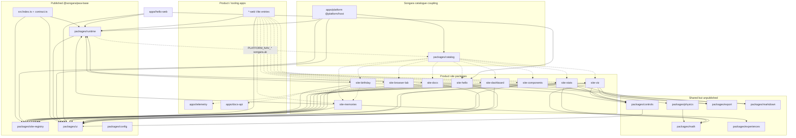

# Milestone 0 — Repository Inventory (T0.1)

**Repo:** PWA-Base (`@songara/pwa-base`)  
**Branch:** `feature/discovery-repository-uv2`  
**Date:** 2026-08-06  
**Method:** Verified against source (`package.json`, imports, file trees, LOC). Documentation was **not** used as evidence (known inaccurate — still describes predecessor "Website Hosting" multi-app host).

**Recommendation legend**

| Tag | Meaning |
| --- | --- |
| **Keep** | Belongs in the reusable PWA foundation (possibly after decoupling). |
| **Extract then delete** | Product app; extract named reusable pieces first, then delete. |
| **Delete** | Product-coupled; no worthwhile reusable core (or already superseded). |

LOC counts are TypeScript/TSX/JS/CSS under each tree, excluding `node_modules` / `dist`.

---

## 1. Published surface (`@songara/pwa-base`)

| Item | Purpose (from source) | Reusable infrastructure | Product-specific | Dependencies | Recommendation |
| --- | --- | --- | --- | --- | --- |
| `src/index.ts` | Public API: re-exports runtime + site-registry contract + UI | Gate for consumers | Indirectly exports Songara catalogue nav via runtime chrome | Relative imports into `packages/{runtime,site-registry,ui}` | **Keep** — but split chrome nav out of the export (see open questions) |
| `src/contract.ts` | React-light contract-only subpath | `defineSite`, `SITE_CAPABILITY`, types | Hostnames appear only on `CatalogEntryMeta.host` consumers | `packages/site-registry` | **Keep** |
| `package.json` `exports` / `files` | Ships `src`, `runtime`, `site-registry`, `ui`, selected `config` | Curated foundation | Does **not** ship physics/math/export/markdown/controls/experiences | peer: react, react-dom, react-router-dom; dep: workbox-window | **Keep** — expand allowlist after extraction decisions |

**Exported but product-coupled (blast radius for consumers):**

- `PLATFORM_HOME`, `PLATFORM_NAV_*`, `PLATFORM_NAV_GROUPS`, `PLATFORM_LOGO_ORIGIN`, `PLATFORM_LOGO_ACCENTS`, `platformNavLogoUrl`, etc. from `packages/runtime/src/chrome/nav.ts` + `logoAccent.ts` — hardcoded `*.songara.uk` Media/Monitoring/Workspace/Apps catalogue.
- `PlatformChrome` / `MegaBar` always render that catalogue.
- Preference key `songara-platform-prefs:v1`, topbar key `songara-topbar-collapsed`.

**Reusable but not exported / not in `files`:**

- `@platform/physics`, `@platform/math`, `@platform/export`, `@platform/markdown`, `@platform/controls`, `@platform/experiences`
- Content-pack tooling (`scripts/sync-content-pack.mjs`, `scripts/ensure-sibling-file-deps.mjs`)
- Lab/canvas/audio harnesses trapped in product packages (see §5)

---

## 2. Apps inventory

Thin Vite wrappers (`*-web`) mount a site package via `SoloSiteApp` + `ThemeProvider` + PWA. LOC is mostly config.

| App | LOC / files | Purpose | Reusable inside | Product-specific | Depends on → | Depended on by | Recommendation |
| --- | --- | --- | --- | --- | --- | --- | --- |
| `apps/hello-web` | 91 / 4 | Solo PWA entry for Hello reference | Vite+PWA+content-pack pattern; only app targeted by `pnpm dev` | Scaffold copy | runtime, site-hello, ui | root `dev` / `dev-server.mjs` | **Keep** (reference app) |
| `apps/birthday-web` | 131 / 6 | Solo packaging for Birthday | Thin shell only | Birthday host, Dockerfile, compose `birthday.songara.uk` | runtime, site-birthday, ui | catalog loaders, compose, e2e smoke | **Extract then delete** |
| `apps/memories-web` | 89 / 5 | Solo packaging for Memories showcase | Thin shell | Memories host | runtime, site-memories, experiences, ui | catalog, compose | **Extract then delete** |
| `apps/viz-web` | 114 / 6 | Solo packaging for Visual Computing | Thin shell | Viz host | runtime, site-viz, ui | catalog, compose | **Extract then delete** |
| `apps/browser-lab-web` | 114 / 6 | Solo packaging for Browser Lab | Thin shell | Browser-lab host | runtime, site-browser-lab, ui | catalog, compose | **Extract then delete** |
| `apps/stats-web` | 114 / 6 | Solo packaging for Statistical Analysis | Thin shell | Stats host | runtime, site-stats, ui | catalog, compose | **Extract then delete** |
| `apps/components-web` | 114 / 6 | Solo packaging for Components showcase | Thin shell | Components host | runtime, site-components, ui | catalog, compose | **Extract then delete** (or keep as design-system docs app — T0.2) |
| `apps/docs-web` | 139 / 6 | Solo packaging for Document Explorer | Thin shell | Docs host; proxies docs-api | runtime, site-docs, ui | catalog, compose | **Extract then delete** (docs-api may stay) |
| `apps/dashboard-web` | 141 / 6 | Solo packaging for AI Dev Dashboard | Thin shell; Vite proxies telemetry | Dashboard host | runtime, site-dashboard, ui | catalog, compose, e2e | **Extract then delete** (moves with telemetry) |
| `apps/platform` (`@platform/host`) | ~4.0k / 34 | Catalogue host `apps.songara.uk` — landing, sidebar/topbar/command palette, logos, mirrored packs | `joinPaths`, `useSectionReveal`, `useHeroParticles`, `useAtmosphereBreath`, AppShell patterns | Entire Songara catalogue UX; media/monitoring logos; Traefik host | catalog, runtime, site-registry, ui | compose `platform`, e2e `host.spec.ts`, root Dockerfile | **Extract then delete** |
| `apps/telemetry` | ~8.9k / 43 | Node service: Cursor hook ingest, SQLite, WS, completion reports, artifact capture, ntfy inbox | HTTP/SQLite/WS/notify/artifact capture modules; `RunCompletionSummary` contract | Cursor-run lifecycle, Songara AI workflow, port 4310 | config (dev); external `ws`, `tsx` | dashboard, CURSOR.md, `.cursor/rules`, compose, `capture:artifacts`, hook script | **Extract then delete** as product service — see §7 verdict |
| `apps/docs-api` | ~803 / 6 | Read-only Markdown API with sandboxed roots | `fs-access.ts` path sandbox, list/tree/read, HTTP JSON API | Root config tied to Songara docs layout (`config/docs-explorer.roots.json`) | none workspace (runtime) | docs-web (via proxy), compose | **Keep** if Document Explorer stays in foundation tooling; else extract sandbox helpers then delete |

**Note:** `hello-web` has **no** Dockerfile and is **absent** from `docker-compose.yml`.

---

## 3. Packages inventory

### 3.1 Infrastructure packages

| Package | LOC | Purpose | Reusable exports / modules | Product-specific | Deps → | Who depends | Recommendation |
| --- | --- | --- | --- | --- | --- | --- | --- |
| `packages/runtime` | ~2.9k | PWA update controller, connectivity, Content Pack client (Cache API + IndexedDB), preferences, SoloSiteApp, PlatformChrome | `packs/*`, `storage/packStore.ts`, `pwa/*`, `connectivity/*`, `preferences/*`, `SoloSiteApp`, `PackReadyGate` | Hardcoded Songara nav (`chrome/nav.ts`, `logoAccent.ts`); MegaBar always shows it; `songara-*` storage keys | workbox-window; peer react, react-router-dom | All `*-web`, host, site-hello/birthday/memories, published API | **Keep** after decoupling chrome catalogue data from runtime |
| `packages/site-registry` | ~139 | Site registration contract | `defineSite`, `SITE_CAPABILITY`, `SiteDefinition`, `CatalogEntryMeta` | `host` field assumes independent Songara hostnames | none | All sites, catalog, published API | **Keep** |
| `packages/ui` | ~1.7k | Design tokens + primitives + theme | Button, Link, Stack, fields, Panel, Surface, ThemeProvider, tokens.css | Token names/branding are Songara Studio flavoured but generic | peer react | Nearly all apps/sites; published | **Keep** |
| `packages/config` | ~147 | Shared tsconfig / eslint / prettier / `vite-app-version` | Config baselines + Vite version plugin | None material | eslint ecosystem | All packages (dev) | **Keep** |
| `packages/controls` | ~189 | Parameter panel for demos | `ParameterPanel`, `ParamDef` types | None | ui | site-viz, site-stats, site-components, site-birthday | **Keep** — not currently published |
| `packages/math` | ~85 | Numeric + sample stats helpers | `clamp`, `lerp`, `inverseLerp`, `linspace`, `sum`/`mean`/`varianceSample`/`stdevSample` | None | none | physics, site-viz, site-stats | **Keep** — not published |
| `packages/physics` | ~2.5k | Renderer-agnostic fixed-timestep sim engine | World/System, ParticleBuffer, forces, constraints, collision, SpatialHash2D, ScalarField, noise, oscillators (`AdsrEnvelope`, waveforms), damping | None in package itself | math | **Only** site-viz cymatics + audio-lab `stemSynth` | **Keep** — sole real consumer is product; still foundation-grade |
| `packages/export` | ~36 | Browser download helpers | `downloadText`, `downloadBlob`, `downloadCanvasPng` | None | none | site-viz, site-stats | **Keep** — not published |
| `packages/markdown` | ~248 | GFM + highlight Markdown React renderer | `Markdown`, `styles.css` | None | react-markdown, remark-gfm, rehype-highlight | site-docs, site-dashboard | **Keep** — not published |
| `packages/experiences` | ~3.7k | Parameterised Memory Experience stages (R3F/Three) | `ExperienceStage`, SnowGlobe / MusicBox / FridgeDoor, `parseExperienceInstance`, types, WebGL probe | Showcase instance JSON; Birthday constellation intro; music-box Web Audio lullaby | three, @react-three/fiber, drei | site-memories, memories-web | **Keep** as library (move out of product coupling) or extract with Memories |
| `packages/catalog` | ~189 | Songara app catalogue metadata + lazy loaders | Pattern of `CatalogEntryMeta` + loaders is reusable | Hardcoded all product hosts; depends on every site package | all site-* | host only (runtime code); loaders for tests/tooling | **Delete** with catalogue host (contract types live in site-registry) |

### 3.2 Product site packages

| Package | LOC | Purpose | Reusable trapped inside | Product-specific | Deps → | Who depends | Recommendation |
| --- | --- | --- | --- | --- | --- | --- | --- |
| `packages/site-hello` | ~119 | Minimal reference site + hello-base pack | PackReadyGate usage pattern | Hello copy | runtime, site-registry, ui | hello-web, catalog | **Keep** |
| `packages/site-birthday` | ~16.9k | Premium birthday keepsake (chapters, bedroom scene, lanterns, media) | See §5: `LanternField`, opening motion, hooks (`useReducedMotion`, `useInView`, `useParallax`), scene geometry helpers, pack loading | Recipient keepsake content, chapters, bedroom authoring, wax seal, Konami | controls, runtime, **site-memories**, site-registry, ui | birthday-web, catalog | **Extract then delete** |
| `packages/site-memories` | ~4.4k | Showcase of experiences + Find Us constellation moment | `FindUsMoment` (~649 TSX + CSS), constellation renderer/transform/alignment tool | Showcase catalogue UI; find-us.config | experiences, runtime, site-registry | memories-web, **site-birthday** (FindUsMoment), catalog | **Extract then delete** |
| `packages/site-viz` | ~22.6k | Optical illusions + flagship labs (canvas/WebGL/audio) | LabShell/FlagshipShell, `useAnimationFrame`, canvas setup, audio-lab engine (~4.2k), cymatics (physics consumer), exhibits lib | Specific demos/illusions/labs | controls, export, math, **physics**, site-registry, ui | viz-web, catalog | **Extract then delete** |
| `packages/site-browser-lab` | ~6.4k | Live browser instrumentation & benchmarks | Capability probes (display/network/system/storage/audio/graphics/input/performance), `Sparkline`, `Gauge`, benchmark hooks, `useReducedMotion` (duplicate) | Lab chrome / theming | site-registry, ui | browser-lab-web, catalog | **Extract then delete** |
| `packages/site-stats` | ~1.4k | t-test / correlation / regression + CSV UI | `AnalysisChart` (SVG bar+scatter), CSV helpers, thin math wrappers | Stats product UX | controls, export, math, site-registry, ui | stats-web, catalog | **Extract then delete** |
| `packages/site-components` | ~3.0k | Interactive showcase of `@platform/ui` + controls | Living catalogue generator (`generate:catalog`); documents design system | Showcase chrome | controls, site-registry, ui | components-web, catalog | **Extract then delete** or **Keep** as design-system companion — T0.2 |
| `packages/site-docs` | ~934 | Document Explorer UI over docs-api | Explorer layout patterns | Root list / Songara docs browsing | markdown, site-registry, ui, react-markdown | docs-web, catalog | **Extract then delete** (or keep with docs-api) |
| `packages/site-dashboard` | ~8.4k | AI Dev Dashboard UI (History, Ops, Settings, Notifications) | Screenshot lightbox/gallery, WS client hook, completion report renderers, markdown conversation view | Cursor tasks/runs/ops; couples to telemetry API | markdown, site-registry, ui | dashboard-web, catalog | **Extract then delete** with telemetry |

**Coupling note:** `site-birthday` → `site-memories` is a real import (`FindUsMoment` via `FindUsMomentStage.tsx`). Deleting Memories without extracting that moment breaks Birthday.

**Charts note:** Prior concern said charts/sparklines are "duplicated" across site-stats and site-browser-lab. Source shows **different** components (`AnalysisChart` vs `Sparkline`), both hand-rolling linear scales — not copy-paste. Confirmed duplicate: `useReducedMotion` in both birthday and browser-lab.

---

## 4. Repo-level infrastructure

| Item | Purpose | Reusable? | Product coupling | Recommendation |
| --- | --- | --- | --- | --- |
| `scripts/dev-server.mjs` | Background Vite for hello-web (:5182) | Yes for reference | Hardcodes `@platform/hello-web` | **Keep** |
| `scripts/ensure-sibling-file-deps.mjs` | KanDev sibling `file:` linker | Yes — ADR-006 | None | **Keep** |
| `scripts/sync-content-pack.mjs` | Hash + mirror Content Packs | Yes | Examples mention birthday | **Keep** |
| `scripts/sync-birthday-pack.mjs` | Birthday shorthand → generic sync | No | Birthday-only | **Delete** with Birthday |
| `scripts/new-app.mjs` | Scaffold site + web app | Yes after rewrite | Patches `catalog/entries.ts`, `loaders.ts`, `runtime/.../nav.ts`, `logoAccent`, `${name}.songara.uk` | **Keep** after decoupling from catalogue/nav |
| `scripts/bump-version.mjs` | VERSION bump | Yes | None | **Keep** |
| `scripts/telemetry-hook.sh` | POST Cursor hooks → :4310 | With telemetry | Songara endpoints | Move with telemetry |
| `scripts/capture-birthday-previews.mjs` | Birthday preview capture | No | Birthday | **Delete** |
| `scripts/generate-catalogue-logo-placeholders.mjs` | Catalogue logo SVGs | No | Catalogue | **Delete** with host |
| `e2e/host.spec.ts` | Catalogue + mega-bar | No | Songara hosts/sections | Rewrite or delete with host |
| `e2e/dashboard-report.spec.ts` | Dashboard History/notifications | With telemetry | Dashboard | Move with dashboard |
| `e2e/birthday-launcher-smoke.spec.ts` | Birthday experiences smoke | No | Birthday | **Delete** |
| `playwright.config.ts` | Boots host + dashboard-web | — | Product apps | Slim to hello (+ optional) |
| `playwright.birthday-smoke.config.ts` | Birthday smoke project | No | Birthday | **Delete** |
| `docker-compose.yml` | platform, telemetry, docs-api, all product webs | Pattern reusable | All `*.songara.uk` Traefik; container names `website-hosting-*` | Strip to foundation services |
| Root `Dockerfile` | Builds catalogue host only | — | Copies many product package.jsons; nginx-catalogue | Replace with hello or remove |
| `docker/*.conf` | nginx SPA / docs / dashboard / catalogue | SPA template reusable | Product-specific confs | Keep `nginx-spa.conf`; delete product confs |
| `config/docs-explorer.roots.json` | Allowed docs-api roots | — | Local Songara roots | Product / env-specific |
| Root `package.json` scripts | monorepo orchestration | Many | `birthday:*`, `telemetry:*`, `docs-api:*`, test filters list product pkgs | Slim scripts |

---

## 5. Extraction candidate list

Reusable capability currently trapped in product code. Complexity = rough LOC + coupling.

| ID | Candidate | Paths | ~Size | Complexity | Notes |
| --- | --- | --- | --- | --- | --- |
| E1 | Decouple platform chrome nav | `packages/runtime/src/chrome/{nav,logoAccent,MegaBar,PlatformChrome,NavLogoChip}.ts(x)` | ~600+ | Medium | Inject nav config; stop exporting Songara hosts from `@songara/pwa-base` |
| E2 | Content Pack stack (already in runtime) | `packages/runtime/src/packs/*`, `storage/packStore.ts` | ~800 | Low (already foundation) | Ensure published + documented; used by hello + birthday |
| E3 | LanternField particle/wish UI | `site-birthday/.../LanternField.tsx` (+ CSS) | ~627 | Medium | Genericise wish pool / tones |
| E4 | Opening / ritual motion | `KeepsakeOpeningStage`, `WaxSealOpening`, `OpeningConstellation`, `NightSky` | ~800+ | High | Tied to keepsake design tokens |
| E5 | Birthday generic hooks | `useReducedMotion`, `useInView`, `useParallax` | ~93 | Low | Dedupe with browser-lab / host `useSectionReveal` |
| E6 | Bedroom scene / geometry engine | `site-birthday/src/scene/**` | ~5k+ | Very high | Mostly product; some SVG/geometry primitives may be salvageable |
| E7 | FindUsMoment + constellation | `site-memories/src/moments/**` | ~3.5k | High | Exported; used by Birthday |
| E8 | Memory Experiences library | `packages/experiences/**` | ~3.7k | Medium | Already a package; publish or move to own repo |
| E9 | Viz lab shell / RAF | `site-viz/src/lab/*`, `flagship/shared/{useAnimationFrame,FlagshipShell,rng,pointer,storage}` | ~2.5k | Medium | Good foundation for canvas labs |
| E10 | Canvas setup helpers | `site-viz/src/canvas/setup.ts` + exhibit libs | ~200+ | Low–Medium | |
| E11 | Audio Lab engine | `site-viz/.../audio-lab/engine/*`, stems, drums, synth | ~4.2k total lab | High | Web Audio graph; uses physics oscillators |
| E12 | Cymatics physics demo | `site-viz/.../cymatics/**` | ~2.4k | Medium | **Only** full physics World consumer — keep as reference sample or extract |
| E13 | Browser capability probes | `site-browser-lab/src/sections/**`, hooks | ~3.2k | Medium | Instrumentation services |
| E14 | Sparkline + Gauge | `site-browser-lab/src/components/{Sparkline,Gauge}.*` | ~300+ | Low | Publish under ui/charts |
| E15 | AnalysisChart | `site-stats/.../AnalysisChart.*` | ~180 | Low | Not a Sparkline duplicate |
| E16 | docs-api path sandbox | `apps/docs-api/src/fs-access.ts` | ~200+ | Low | Generic |
| E17 | Markdown package | `packages/markdown` | ~248 | Low | Publish |
| E18 | Telemetry completion contract | `apps/telemetry/src/{types,completion-report-contract,completion-summary}.ts` | ~1.1k | Medium | Engineering contract SoT — relocate if telemetry leaves |
| E19 | Artifact capture CLI | `apps/telemetry/src/artifacts/*` | ~600 | Medium | Used by `pnpm capture:artifacts` |
| E20 | Host motion hooks | `apps/platform/src/hooks/{useHeroParticles,useAtmosphereBreath,useSectionReveal}.ts` | ~240 | Low–Medium | |
| E21 | ParameterPanel / export / math / physics | already packages | see §3.1 | Low | Add to published surface |

---

## 6. Dependency map

Edges that **break if product apps/sites are deleted** are marked `-.->` (fragile). Solid arrows are foundation-worthy.

**Fragile edges if products deleted without extraction:**

| Edge | Breakage |
| --- | --- |
| `catalog` → every `site-*` | Host/tests/tooling loaders fail |
| `runtime` chrome → Songara nav lists | Solo apps still show deleted products + homelab links |
| `site-birthday` → `site-memories` | Birthday Find Us stage breaks |
| `site-viz` → `physics` | Physics loses only production consumer (package itself OK) |
| `site-dashboard` → `telemetry` | Dashboard dead |
| `new-app.mjs` → catalog + nav.ts | Scaffolding fails |
| Root scripts / compose / e2e / Dockerfile | Many references to product filters and hosts |
| CURSOR.md + `.cursor/rules` → telemetry types | Engineering contract SoT must relocate |

---

## 7. Telemetry verdict

**Verdict: product / Songara AI-dev workflow service — not core PWA foundation.**

Evidence it is **not** generic PWA infrastructure:

- Description and modules centre on Cursor hooks, Tasks/Runs lifecycle, ntfy inbox, ops diagnostics for autonomous agents.
- Compose publishes `:4310` with Traefik disabled; dashboard Vite proxies it.
- Only UI consumer is `site-dashboard`.

Evidence of **high blast radius** (must be relocated or replaced, not casually deleted):

| Consumer | Role |
| --- | --- |
| `CURSOR.md` Reporting section | Points at `RunCompletionSummary` / completion-report-contract |
| `.cursor/rules/run-report-standard.mdc` | alwaysApply rule |
| `scripts/telemetry-hook.sh` | Cursor hook POST |
| `pnpm capture:artifacts` / `telemetry:*` scripts | Artifact capture |
| `docker-compose.yml` `telemetry` service | Runtime |
| `packages/site-dashboard/**` | Full API client |
| `e2e/dashboard-report.spec.ts` | Tests |
| Root / dashboard Docker nginx confs | `/telemetry` proxy paths |

**Recommendation for T0.2:** Extract or republish the **completion-report contract + capture CLI** into a small foundation-adjacent package (or `docs/` + types package), then move telemetry+dashboard to a separate product repo. Do not leave the always-on Cursor rule pointing at a deleted tree.

---

## 8. Reference application assessment

**Candidate: `apps/hello-web` + `packages/site-hello` — correct choice.**

Why it fits:

- Already the sole target of `pnpm dev` / `scripts/dev-server.mjs`.
- Exercises the important foundation path: `ThemeProvider` → `SoloSiteApp` → `defineSite` → `PackReadyGate` → Content Pack read (`getPackEntryText`).
- Tiny (~210 LOC combined), offline capability, mirrored pack under `public/packs`.

Gaps to be a good reference after rationalisation:

1. **Decouple chrome** — today Hello still ships Songara mega-bar catalogue via `PlatformChrome`.
2. Add Dockerfile + optional compose service (parity with other PWAs) **or** document local-only intentionally.
3. Add a minimal Playwright smoke (PWA manifest + pack ready + hello text).
4. Demonstrate one unpublished shared package once published (e.g. `downloadText` or `ParameterPanel`) — optional.
5. Stop scaffolding `new-app` from requiring catalogue/nav patches; Hello should be the template without Songara hostnames.

**Alternatives rejected as "minimal reference":** components-web (showcase, larger), birthday (product keepsake), viz (lab suite).

---

## 9. Open questions / risks for T0.2

1. **Chrome navigation ownership** — Should `PlatformChrome` accept injected nav groups (foundation), or should solo apps ship without mega-bar by default?
2. **Publish allowlist expansion** — Which of physics/math/export/markdown/controls/experiences become `@songara/pwa-base` subpaths vs stay workspace-only vs own repos?
3. **Telemetry relocation** — Where does `RunCompletionSummary` live so CURSOR.md / always-on rules keep working after deletion?
4. **site-components** — Keep as design-system living docs inside foundation, or delete and rely on external Storybook/docs?
5. **docs-api + site-docs** — Foundation tooling vs Songara-only? Path-sandbox is reusable either way.
6. **experiences package** — Keep in PWA-Base as reusable R3F library, or move with Memories/Birthday product repo?
7. **Physics without viz** — Keep package with a tiny sample in hello/docs, or move with Visual Computing product?
8. **Catalogue host deletion** — Confirm complete clone elsewhere covers `apps.songara.uk` logos, Traefik labels, and mirrored packs before delete.
9. **Duplicate hooks** — Consolidate `useReducedMotion` / intersection reveal into `runtime` or `ui` before deletes.
10. **Root Dockerfile / compose naming** — Still `website-hosting-*`; renaming is out of M0 scope but blocks clean foundation image.
11. **Docs drift** — Architecture/guides still describe multi-app host; Milestone 0 says do not fix — schedule doc pass after dispositions.
12. **Birthday ↔ Memories edge** — Extraction order must respect `FindUsMoment` dependency.

---

## 10. Summary disposition sketch (non-binding for T0.2)

| Keep in foundation | Extract then delete | Delete with little extraction |
| --- | --- | --- |
| runtime (decoupled), site-registry, ui, config, controls, math, physics, export, markdown, experiences (?), hello-web + site-hello, scripts (generic), ensure-sibling-file-deps, sync-content-pack | birthday*, memories*, viz*, browser-lab*, stats*, components*?, docs*, dashboard*+telemetry*, platform/catalog, docs-api? | sync-birthday-pack, capture-birthday-previews, generate-catalogue-logo-placeholders, birthday e2e/playwright smoke, product nginx confs |

\* = extract candidates in §5 first.

---

## 11. Validation (T0.1)

- Dependency claims cross-checked against each workspace `package.json` and ripgrep of `@platform/*` imports.
- Physics consumers confirmed: only `site-viz` cymatics + `stemSynth` oscillators.
- Experiences consumers confirmed: only `site-memories` (+ memories-web package.json).
- Markdown consumers: `site-docs`, `site-dashboard`.
- Catalog consumers: `apps/platform` (+ loaders for tests).
- Charts: AnalysisChart ≠ Sparkline (not duplicate implementations).
- `useReducedMotion` duplicated in birthday and browser-lab.
- Git: only new artifact under `docs/artifacts/milestone-0-rationalisation/` plus pre-existing untracked `.cursor/mcp.json`.
