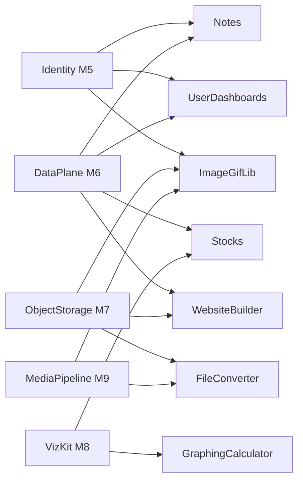

# Application Ideas & Capability Mapping

> **Historical — not current intent.** Living north star:
> [VISION.md](./VISION.md) and [ADR-007](../adr/007-pwa-base-reusable-foundation.md).
> Milestone 2 archives this file.

| | |
| --- | --- |
| **Status** | Historical (superseded by VISION v1 / ADR-007) |
| **Version** | 0.1.0 |
| **Last reviewed** | 2026-07-21 |
| **Related** | [VISION.md](./VISION.md) · [PLATFORM.md](./PLATFORM.md) · [ROADMAP.md](./ROADMAP.md) |

---

## Purpose

Map current and planned applications to reusable capabilities so engineering effort is not duplicated. Before starting an app: identify what to **reuse**, what **new capability** (if any) belongs on the platform, and which roadmap milestones must land first.

## How to update

When proposing a new app idea: add a row/section with purpose, reuse, new caps, overlap, effort, priority. When an app ships: move it to **Existing applications** and refresh capability links. Never invent platform capabilities inside a single site if PLATFORM.md marks them as platform-level.

**Effort:** S · M · L · XL (relative to this monorepo’s norms).

---

## Existing applications

| Application | Purpose | Capabilities reused | New capabilities required | Engineering overlap | Effort | Priority |
| --- | --- | --- | --- | --- | --- | --- |
| Components (`components.songara.uk`) | Design-system catalogue | Host, ui, controls, catalogue gate | None | — | — | Maintain |
| Statistical Analysis (`stats.songara.uk`) | Hypothesis tests, regression, CSV | Host, ui, controls, export, math; **local** charts/table/CSV | Shared chart kit only if 2nd consumer | Overlaps future stocks/calculator charts | — | Maintain; do not extract charts alone |
| Visual Computing (`viz.songara.uk`) | Labs, canvas/WebGL, audio | Host, ui, controls, export, math, physics (narrow); **local** lab chrome | VizKit / canvas kit only with 2nd consumer | Calculator, future sims | — | Maintain |
| Birthday (`birthday.songara.uk`) | Keepsake experience | Host, tokens (ui mostly unused beyond CSS) | None platform | Media/UX patterns are bespoke | — | Maintain; trim unused deps opportunistically |
| Browser Lab (`browser-lab.songara.uk`) | Browser instrumentation | Host, ui; **local** gauges/sparklines | Shared charts only with 2nd consumer | Stats charts | — | Maintain |
| AI Development Dashboard (`dashboard.songara.uk`) | Cursor Tasks/Runs, ops, notifications | Host, ui, telemetry service, PWA | Contract consolidation (M3); optional Push later | Observability ≠ general app data | — | Maintain; prefer telemetry evolution over parallel stacks |

---

## Planned applications

### Notes

| Field | Content |
| --- | --- |
| **Purpose** | Personal notes / lightweight content for self-hosted use |
| **Capabilities reused** | Host, ui; after roadmap: Identity (M5), App Data Plane (M6), Host Shell (M11) |
| **New capabilities required** | Content/notes model (search, folders/tags)—prefer as app schema on the data plane first; promote only if a second content app appears |
| **Potential engineering overlap** | User dashboards (lists/detail); website builder (structured content) later |
| **Estimated effort** | L |
| **Suggested priority** | **High** after M5–M6; ideal **M10 Content Spine** proving ground |

### Stock analysis and charting

| Field | Content |
| --- | --- |
| **Purpose** | Analyse instruments: series, indicators, charts |
| **Capabilities reused** | Host, ui, math; Data Plane (watchlists/saved views); VizKit (M8) when extracted |
| **New capabilities required** | Market data ingest (app- or service-specific); chart kit shared with calculator/stats |
| **Potential engineering overlap** | Graphing calculator; stats `AnalysisChart`; dashboard widgets |
| **Estimated effort** | XL |
| **Suggested priority** | After M6; **VizKit (M8)** when calculator or stats becomes second consumer |

### Website builder

| Field | Content |
| --- | --- |
| **Purpose** | Compose simple sites/pages with assets |
| **Capabilities reused** | Host, ui; Object Storage (M7); Identity; Data Plane (page docs) |
| **New capabilities required** | Page/block schema; asset pipeline (Media M9 for images) |
| **Potential engineering overlap** | Notes (documents); media library (assets) |
| **Estimated effort** | XL |
| **Suggested priority** | After M7 (and ideally M9 for images) |

### Graphing calculator

| Field | Content |
| --- | --- |
| **Purpose** | Interactive mathematical graphing |
| **Capabilities reused** | math, controls, ui; canvas patterns from viz; VizKit when shared |
| **New capabilities required** | Expression parser (app-local until second consumer); plot kit |
| **Potential engineering overlap** | Stocks charts; viz labs |
| **Estimated effort** | M–L |
| **Suggested priority** | Strong candidate to **create the second VizKit consumer** alongside stocks or upgraded stats charts |

### File viewer / converter

| Field | Content |
| --- | --- |
| **Purpose** | View and convert files between formats |
| **Capabilities reused** | Object Storage (M7), Media Pipeline (M9), Identity, ui |
| **New capabilities required** | Conversion workers/codecs (may stay service-local modules) |
| **Potential engineering overlap** | Image/GIF management (same storage + pipeline) |
| **Estimated effort** | L |
| **Suggested priority** | After M9 |

### Image and GIF management

| Field | Content |
| --- | --- |
| **Purpose** | Library for images/GIFs with browse/organise |
| **Capabilities reused** | Object Storage, Media Pipeline, Identity, Data Plane (metadata), ui |
| **New capabilities required** | Gallery UX (app-local); thumbs/transcode via M9 |
| **Potential engineering overlap** | File converter; website builder assets |
| **Estimated effort** | L |
| **Suggested priority** | After M9; pair with converter to satisfy two-consumer media use |

### Dashboards (user / personal)

| Field | Content |
| --- | --- |
| **Purpose** | Personal or household operational dashboards (distinct from AI Dev Dashboard) |
| **Capabilities reused** | Host, ui, Identity, Data Plane; later VizKit widgets |
| **New capabilities required** | Widget model (app-local until second dashboard product) |
| **Potential engineering overlap** | Notes lists; stock widgets; browser-lab metrics UX |
| **Estimated effort** | L |
| **Suggested priority** | After M5–M6 |

### Productivity tools (misc)

| Field | Content |
| --- | --- |
| **Purpose** | Small tools (checklists, converters, calculators, etc.) |
| **Capabilities reused** | Host, ui, and whichever of Identity/Data/Storage the tool needs |
| **New capabilities required** | Case-by-case; apply two-consumer rule before extracting |
| **Potential engineering overlap** | Entire platform |
| **Estimated effort** | S–L |
| **Suggested priority** | Opportunistic—prefer tools that exercise existing capabilities |

---

## Overlap map (avoid duplicate engineering)

**Rule:** If two planned apps need the same backend concern, schedule the **capability milestone** before either app—or build the first app against temporary local storage only with an explicit debt ticket (prefer not to).

---

## Suggested build sequence for apps

1. Keep maintaining existing sites; do not block them on foundations.
2. Land **M2–M6** (truth, contracts, service pattern, identity, data).
3. Ship **Notes (M10)** as the first data-backed product.
4. Add **Object Storage → Media**; then Image/GIF + Converter as a pair.
5. Introduce **VizKit** when Stocks and Calculator (or Stocks and Stats charts) are both real.
6. Website builder after storage/media are boring.
7. User dashboards anytime after identity/data; enrich with VizKit later.

---

## Quick answers

| Question | Answer |
| --- | --- |
| How does every future app fit? | Each row maps to host/UI plus Identity/Data/Storage/Viz/Media milestones—not a new stack. |
| How to minimise duplicate effort? | Read PLATFORM capability status; prefer ROADMAP milestones over site-local auth/db/blob/charts. |
| What should we build first as a product? | **Notes** after Identity + Data Plane. |
