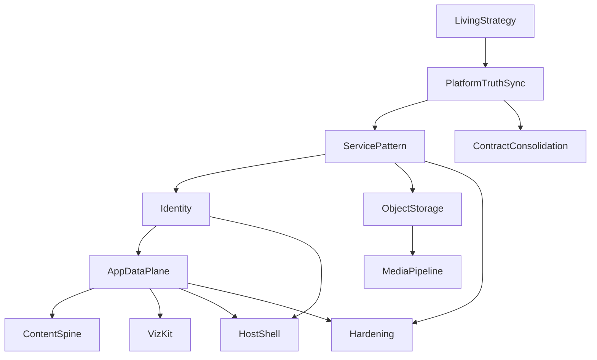

# Engineering Roadmap

| | |
| --- | --- |
| **Status** | Living |
| **Version** | 0.1.0 |
| **Last reviewed** | 2026-07-21 |
| **Related** | [VISION.md](./VISION.md) · [PLATFORM.md](./PLATFORM.md) · [IDEAS.md](./IDEAS.md) |

---

## Purpose

Outcome-oriented milestones ordered by **engineering leverage** (how many future applications each unlocks), not by arbitrary feature desire. Each milestone should answer: why build it, how we know it is done, and what becomes possible next.

## How to update

When a milestone completes: set **Current Status** to Complete, record the date, and adjust dependents. When inventing a new milestone: add a full block (all fields below), update the dependency graph, and refresh prioritisation. Keep milestones as **outcomes**, not task checklists.

**Complexity:** S (small docs/sync) · M · L · XL  
**Engineering value:** relative long-term velocity unlock.

---

## Dependency graph

**Why this order:** document truth first so planning is honest; consolidate contracts cheaply; generalise the only proven sidecar (telemetry) into a service pattern; then identity and data (unlock the most apps); then storage/media; extract VizKit only with a second consumer; prove the stack with a content app; mature shell and hardening once foundations exist.

---

## Milestones

### M1 — Living Strategy Baseline

| Field | Content |
| --- | --- |
| **Current Status** | Complete (2026-07-21) |
| **Purpose** | Establish living strategy documents under `docs/milestones/`. |
| **Problem Being Solved** | Engineering expectations and roadmap lived only in prompts, ADRs fragments, and stale reviews. |
| **Why This Matters** | Without a shared strategy surface, every milestone re-litigates “what exists” and “what to build next.” |
| **What Will Exist Afterwards** | VISION, PLATFORM, ROADMAP, IDEAS; README/architecture pointers. |
| **What This Unlocks** | Trustworthy prioritisation and onboarding for humans and agents. |
| **Dependencies** | None |
| **Estimated Complexity** | S |
| **Estimated Engineering Value** | High (meta) |
| **Why It Should Be Prioritised** | All later planning depends on an accurate shared narrative. |
| **Success Criteria** | The eight success questions in the strategy brief are answerable from `docs/milestones/*` alone; no production code required. |
| **Future Milestones Enabled** | M2+ |

---

### M2 — Platform Truth Sync

| Field | Content |
| --- | --- |
| **Current Status** | Not Started |
| **Purpose** | Align runtime docs with the live catalog, Compose, and telemetry version. |
| **Problem Being Solved** | README/architecture still describe incomplete package maps, Traefik-as-comments, and/or `:8080` publish; testing guide lags real coverage. |
| **Why This Matters** | Stale docs cause wrong rebuild advice and wasted “rebuild foundations that exist” work. |
| **What Will Exist Afterwards** | Updated `architecture.md`, README status/layout, testing guide scope notes; PLATFORM inventory remains the strategy SoT. |
| **What This Unlocks** | Credible near-term planning and safer ops instructions. |
| **Dependencies** | M1 |
| **Estimated Complexity** | S–M |
| **Estimated Engineering Value** | High |
| **Why It Should Be Prioritised** | Lowest-cost fix for planning errors; prerequisite to teaching a service pattern from telemetry. |
| **Success Criteria** | Docs list all six catalogued sites; Compose Traefik/proxy story matches `docker-compose.yml`; telemetry version matches package; testing guide names actual unit/e2e packages. |
| **Future Milestones Enabled** | M3, M4 |

---

### M3 — Contract Consolidation

| Field | Content |
| --- | --- |
| **Current Status** | Not Started |
| **Purpose** | Single shared module for completion-report (and related) types consumed by telemetry and dashboard. |
| **Problem Being Solved** | Mirrored `RunCompletionSummary` and duplicate markdown export helpers drift over time. |
| **Why This Matters** | Report schema is agent-facing SoT; drift breaks dashboard and validation silently. |
| **What Will Exist Afterwards** | One import path for report types/helpers; dashboard and telemetry compile against it. |
| **What This Unlocks** | Safer schema evolution; pattern for other shared contracts later. |
| **Dependencies** | M2 (accurate inventory) |
| **Estimated Complexity** | M |
| **Estimated Engineering Value** | Medium–high |
| **Why It Should Be Prioritised** | Small blast radius, immediate debt reduction, reinforces “one SoT” culture. |
| **Success Criteria** | No duplicate interface definitions; unit tests pass; dashboard History/report e2e green; CURSOR.md / run-report docs point at the shared module. |
| **Future Milestones Enabled** | Cleaner API work under M4+ |

---

### M4 — Platform Service Pattern

| Field | Content |
| --- | --- |
| **Current Status** | Not Started |
| **Purpose** | Codify how a sidecar service sits beside the host (Compose, health, nginx proxy, versioning, volumes)—generalising telemetry lessons. |
| **Problem Being Solved** | Telemetry is a successful one-off; Notes/stocks/media backends would otherwise invent deploy each time. |
| **Why This Matters** | The vision requires **reusable platform services**, not a second monolith of ad-hoc containers. |
| **What Will Exist Afterwards** | Written pattern + checklist (and optional thin template notes) used for the next service; no requirement to rewrite telemetry. |
| **What This Unlocks** | Identity, data plane, object storage as first-class services. |
| **Dependencies** | M2 |
| **Estimated Complexity** | M |
| **Estimated Engineering Value** | Very high |
| **Why It Should Be Prioritised** | Highest leverage before any new backend: multiplies every later service milestone. |
| **Success Criteria** | A maintainer can stand up a new sidecar using the pattern without copying telemetry internals; docs list mandatory health, proxy, version, and volume conventions. |
| **Future Milestones Enabled** | M5, M6, M7, M12 |

---

### M5 — Identity Foundation

| Field | Content |
| --- | --- |
| **Current Status** | Not Started |
| **Purpose** | Application-level authentication for self-hosted users (session and/or OIDC-capable design). Edge CrowdSec remains complementary, not a substitute. |
| **Problem Being Solved** | All apps are effectively public at the app layer; private Notes, libraries, and dashboards are unsafe. |
| **Why This Matters** | Identity unlocks the largest class of future applications in IDEAS.md. |
| **What Will Exist Afterwards** | Login/session (or OIDC) integrated with host/shell; protected routes pattern; no per-app auth forks. |
| **What This Unlocks** | Private data apps, account-aware shell, safe media libraries. |
| **Dependencies** | M4 |
| **Estimated Complexity** | L |
| **Estimated Engineering Value** | Very high |
| **Why It Should Be Prioritised** | Without auth, data plane and storage cannot safely hold personal content. |
| **Success Criteria** | At least one protected route works end-to-end; unauthenticated access denied; credentials/secrets handled via env/Compose; documented operator setup. |
| **Future Milestones Enabled** | M6, M10, M11 |

---

### M6 — App Data Plane

| Field | Content |
| --- | --- |
| **Current Status** | Not Started |
| **Purpose** | First generic persistence service (SQLite- and/or Postgres-capable): migrations, per-app namespaces, CRUD APIs. |
| **Problem Being Solved** | Telemetry SQLite is Cursor-specific; apps cannot store their own domain data on the platform. |
| **Why This Matters** | Data is the bottleneck after identity for Notes, watchlists, and user dashboards. |
| **What Will Exist Afterwards** | A versioned data service following M4; apps consume it via typed clients—not ad-hoc files in the SPA. |
| **What This Unlocks** | Content spine, VizKit-backed apps with saved state, personal dashboards. |
| **Dependencies** | M5 |
| **Estimated Complexity** | XL |
| **Estimated Engineering Value** | Very high |
| **Why It Should Be Prioritised** | Maximises reuse across nearly every planned application. |
| **Success Criteria** | Two different app namespaces can persist and read records; migrations are reproducible; backup story for the volume is documented; tests cover CRUD + authz. |
| **Future Milestones Enabled** | M8, M10, M11, M12 |

---

### M7 — Object Storage Capability

| Field | Content |
| --- | --- |
| **Current Status** | Not Started |
| **Purpose** | Blob/object API with durable backend (Docker volume and/or S3-compatible). |
| **Problem Being Solved** | No place for images, uploads, builder assets, or converted files. |
| **Why This Matters** | Media and website-builder classes cannot start without durable blobs. |
| **What Will Exist Afterwards** | Authenticated upload/download (or signed URL) APIs; retention/size policies documented. |
| **What This Unlocks** | Media pipeline, builder assets, file converter I/O. |
| **Dependencies** | M4 (M5 strongly recommended before exposing private blobs) |
| **Estimated Complexity** | L |
| **Estimated Engineering Value** | Very high |
| **Why It Should Be Prioritised** | After identity/data pattern exists, storage is the next multi-app unlock. |
| **Success Criteria** | Store and retrieve a blob across restart; authz enforced; Compose volume (or external bucket) documented; health check green. |
| **Future Milestones Enabled** | M9 |

---

### M8 — Visualisation Kit

| Field | Content |
| --- | --- |
| **Current Status** | Not Started |
| **Purpose** | Extract shared charting/plot primitives **only when a second consumer exists** (e.g. stocks + graphing calculator, or stats charts + stocks). |
| **Problem Being Solved** | Chart/canvas duplication across sites without a stable shared API. |
| **Why This Matters** | Premature extraction violates ADR-003; waiting too long duplicates work across stock/calculator apps. |
| **What Will Exist Afterwards** | `@platform`-level chart/plot kit with two real consumers. |
| **What This Unlocks** | Stock analysis, graphing calculator, dashboard widgets with less duplication. |
| **Dependencies** | M6 (saved series/state); second consumer commitment |
| **Estimated Complexity** | L |
| **Estimated Engineering Value** | High (when timed right) |
| **Why It Should Be Prioritised** | After data plane; not before a second consumer is real. |
| **Success Criteria** | Two apps import the kit unchanged; site-local chart code reduced; catalogue/docs updated; ADR-003 satisfied. |
| **Future Milestones Enabled** | Stock analysis, calculator polish |

---

### M9 — Media Pipeline

| Field | Content |
| --- | --- |
| **Current Status** | Not Started |
| **Purpose** | Upload, thumbnails, and format conversion on top of object storage. |
| **Problem Being Solved** | Raw blobs alone do not make an image/GIF library or converter usable. |
| **Why This Matters** | Media apps share ingest/transform needs; building them per-app wastes years of effort. |
| **What Will Exist Afterwards** | Pipeline jobs or sync transforms; metadata hooks into the data plane. |
| **What This Unlocks** | Image/GIF manager, file viewer/converter. |
| **Dependencies** | M7 (and M5/M6 for private libraries) |
| **Estimated Complexity** | L–XL |
| **Estimated Engineering Value** | High |
| **Why It Should Be Prioritised** | After storage; enables two+ media applications from IDEAS. |
| **Success Criteria** | Upload → derived asset (e.g. thumb) works; failure modes observable; at least one consumer UI uses the pipeline. |
| **Future Milestones Enabled** | Media apps in IDEAS.md |

---

### M10 — Content Application Spine

| Field | Content |
| --- | --- |
| **Current Status** | Not Started |
| **Purpose** | First real content app (Notes recommended) proving Identity + Data Plane + UI together. |
| **Problem Being Solved** | Foundations risk staying theoretical without a proving ground. |
| **Why This Matters** | Forces API sharpness and UX patterns that later productivity tools copy. |
| **What Will Exist Afterwards** | Catalogued Notes (or equivalent) app; patterns for list/detail/search; documented capability gaps closed or ticketed. |
| **What This Unlocks** | Productivity suite pattern; confidence to build more content apps. |
| **Dependencies** | M5, M6 |
| **Estimated Complexity** | L |
| **Estimated Engineering Value** | High |
| **Why It Should Be Prioritised** | Best ROI “first product” after data plane—broad reuse, moderate complexity. |
| **Success Criteria** | Create/edit/list notes as authenticated user; data survives restart; Playwright covers happy path; no parallel auth/db invented inside the site package. |
| **Future Milestones Enabled** | Further productivity apps; informs M11 |

---

### M11 — Host Shell Maturity

| Field | Content |
| --- | --- |
| **Current Status** | Not Started |
| **Purpose** | Shared app chrome (nav, settings, account), deeper PWA/offline story, optional route code-splitting. |
| **Problem Being Solved** | Apps feel like separate sites; PWA is dashboard-centric; catalog is eager. |
| **Why This Matters** | Cohesive product UX increases reuse of shell capabilities and installability. |
| **What Will Exist Afterwards** | Account-aware shell; clearer cross-app navigation; measured bundle improvements if lazy routes land. |
| **What This Unlocks** | Coherent multi-app product experience. |
| **Dependencies** | M5, M6 (account + settings data) |
| **Estimated Complexity** | L |
| **Estimated Engineering Value** | Medium–high |
| **Why It Should Be Prioritised** | After identity/data so chrome has something real to show. |
| **Success Criteria** | Signed-in user visible in shell; settings persist; PWA story documented for multi-app; no regression in e2e mounts. |
| **Future Milestones Enabled** | Polished multi-app UX |

---

### M12 — Hardening & Operability

| Field | Content |
| --- | --- |
| **Current Status** | Not Started |
| **Purpose** | CI gates, backup/restore runbooks for volumes, observability beyond Cursor telemetry. |
| **Problem Being Solved** | Growth without gates and backups is fragile on a long-lived Proxmox host. |
| **Why This Matters** | Longevity of the ecosystem depends on operability, not only features. |
| **What Will Exist Afterwards** | CI running lint/typecheck/test; documented backup for telemetry and data/blob volumes; basic health/alerting conventions. |
| **What This Unlocks** | Safer velocity for all later milestones. |
| **Dependencies** | M4; M6 when data volumes exist |
| **Estimated Complexity** | M–L |
| **Estimated Engineering Value** | High |
| **Why It Should Be Prioritised** | Parallelisable with product work; do not wait until a data-loss incident. |
| **Success Criteria** | CI fails on typecheck/test failure; restore drill documented and performed once; service health conventions listed in ops docs. |
| **Future Milestones Enabled** | Sustainable long-term roadmap |

---

## Prioritisation

### Immediate

| Milestone | Justification |
| --- | --- |
| **M1 Living Strategy** | Done—creates the planning surface. |
| **M2 Platform Truth Sync** | Stops planning from stale Traefik/8080/catalog facts. |
| **M3 Contract Consolidation** | Cheap SoT fix for agent-facing report types. |

### Near-term

| Milestone | Justification |
| --- | --- |
| **M4 Service Pattern** | Multiplies every future backend. |
| **M5 Identity** | Unlocks private apps—largest IDEAS cluster. |
| **M6 App Data Plane** | Unlocks Notes, dashboards, watchlists, saved viz state. |

Start **M12 CI subset** in parallel once M2 is done (lint/typecheck/test workflow)—do not block on full backup story.

### Long-term

| Milestone | Justification |
| --- | --- |
| **M7 Object Storage** | Required for media/builder classes. |
| **M8 VizKit** | Only with a real second consumer. |
| **M9 Media Pipeline** | Shared ingest for image/GIF + converter. |
| **M10 Content Spine** | Proves M5–M6 with Notes. |
| **M11 Host Shell** | Product cohesion after auth/data. |
| **M12 Hardening (full)** | Backups + broader observability. |

### Experimental

| Idea | Why experimental |
| --- | --- |
| Extract a site to its own deployable | Supported by ADR-002 notes; only if a site outgrows the monolith |
| Multi-node / HA SQLite→Postgres for everything | Premature before single-node data plane is proven |
| AI features inside end-user apps (beyond Cursor telemetry) | Different product problem; reuse telemetry patterns carefully |
| Web Push | Documented gap; wait until notification value is clear |
| Full shared canvas/WebGL framework | Violates two-consumer rule until labs demand it |

---

## Quick answers

| Question | Answer |
| --- | --- |
| Greatest long-term value milestone? | **M4 → M5 → M6** (service pattern, identity, data plane)—after truth sync. |
| Why this ordering? | Honesty → cheap contracts → repeatable services → security → data → storage/media → product proof → shell/ops. |
| How do I know a milestone is finished? | Its **Success Criteria** row. |
| What does each unlock? | **What This Unlocks** / **Future Milestones Enabled** per block. |
